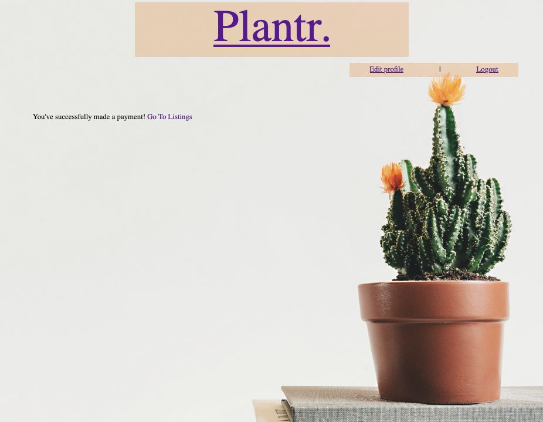

# README
## Plantr.

### What Problem Will Plantr. solve and Why?
There are many marketplace apps to connect members of the community to sell/exchange objects to each other. Gumtree, for example, has a "Pots and Garden Beds" section however it lacks specificity, only allowing for photos, a title, a description, weather the item is being sold or sought and the price. 

Plantr. will improve user's browsing ability by prompting sellers to list more specific features including; drainage, material, shape and dimensions.

For example, a user views a pot listed by a seller. The photo does not show if there is drainage and is taken on a plain background, so there is nothing to reference size. The user requires a specific size and drainage but likes the style of the seller's listing. The user messages the seller to ask about size and drainage, and the seller could take a day or more to get back to the user, only for the user to find the pot is inappropriate. The seller is disappointed that they have not sold their listing and a day has been wasted for both parties. 

### Deployed app:
<a href="https://damp-anchorage-55875.herokuapp.com/">https://damp-anchorage-55875.herokuapp.com/</a>

### Github repository:
<a href="https://github.com/aes89/Plantr.">https://github.com/aes89/Plantr.</a>

### App Description:
#### Purpose
This app was developed to connect people in the community to buy pots, planters and other containers for growing plants from each other.

#### Functionality/Features

- Users: a user can sign up for an account. This gives them access to the other functions (they can only view the home page without signing in) as well as updating their profile (name, email and password).
- Listings: a user can both make and purchase listings. Once a user has made a listing they can return to it to edit it and delete it. A user can view a list of all of their listings, as well as browse through all available listings (listing summaries are displayed on the "browse" page) and view a listing's specifics on the listing's dedicated page.
- Comments: users can leave comments on a specific listing's page. Only the seller (who created the listing) can remove comments, in case they are inappropriate or irrelevant (e.g. another user may make repeated requests to lower the price).
- Payments: a user can purchase a listing which is supported by Stripe. THey click "buy now" and are redirected to Stripe, who manages the payment. Once complete they are redirected back to the app, the listing is marked as "unavailable" and is no longer shown on the "browse" page.
- Transactions: users can view the listings that they have bought and sold on a "transactions" page.

#### Sitemap
Planned site map:

Final site map:

#### Screenshots
Click images to view full size.
|||||
|---|---|---|---|
|Home Page - Not Authenticated|Log In|Sign Up|Home Page - Authenticated|
||||||
|Edit Profile|User's Transactions|All User's Listings|Browse All Listings|
|||||
|Form for New Listing|Form for Edit Listing|View a Specific Listing - Comments Under the Listing (Header Present but Not Shown)|Successful Payment Page|

#### Target Audience
This app is designed for anyone looking to purchase or sell pots, planters or other containers for growing plants to other people in the community. Current features are designed for an individual selling a unique, second hand item rather than businesses/mass produced items, but this could be expanded on in the future.

#### Tech Stack
##### Front-end
- HTML
- CSS
- SCSS
- Ruby 2.6.3
- Ruby on Rails 6.0.3
- Stripe
- Postgres
- AWS 
- 
  
##### Database
- Postgresql

##### Deployment
- Heroku

##### Utilities
- Stripe
- Devise
- AWS S3

##### DevOps
- Git
- Github
- VS Code
- Bundler
- Figma
- Lucidchart

### User Stories

As a user, from the home page I can register for an account by clicking "sign up". I will be taken to the registration page where I can enter my name, email and password.

As a user I can log out from any page using the navigation bar "sign out" link. I will be redirected to the home page.

As a buyer, I can browse through listings with a photo and summarised information.

As a buyer, I can view an individual listing and see a photo and detailed information of the listing.

As a user, I can view and individual listing and comment on it to ask questions/reply to questions.

As a buyer, I can purchase a listing by clicking "buy now" on a listing's individual page.

As a user, I can log on from the home page and navigate to my profile. 

As a user, from my profile page I can update my profile details and delete my profile. 

As a seller, from the home page dashboard section, I can navigate to a collection of my listings. From here, I can view/edit/delete my listings.

As a user looking to sell, from my listing's edit page, I can update the specifications of my listing or delete my listing.

As a user looking to sell, I can comment on my own listing's page and delete other user's comments.

As a user, from the homepage dashboard section I can navigate to a list of bought and sold listings. 

### Wire Frames
| | Mobile | Web/Tablet |
|:---:|:---:|:---:|
|Home Page| ||
|Home Page - Logged In| ||
|Sign Up Page|||
|Login Page|||
|Edit Profile|||
|Individual Listing Page|||

### ERD
Planned ERD:

Implemented ERD:

### High-Level Components and Model Relationships
#### Models

##### User
Most aspects of the User functions were handles with the Devise Gem. Devise has many inbuilt features that are established in the model such as authenticating users, registering users, validating users and remembering users.

###### Relationships:
    has_many :owned_listings, :class_name => 'Listing', :foreign_key => 'seller_id' 

    has_many :bought_listings, :class_name => 'Listing', :foreign_key => 'buyer_id'

  This allows a user id to act both as a buyer and a seller id and reduces duplication withing the schema. 
  Previously, listings were dependent on their seller (i.e. when a user's account was deleted all of their listings were deleted), and this will need to be reconfigured to the seller id.

##### Listing
The listing model works to validate input when making a listing. Many features of the listings have set values which are defined here (e.g. a user cannot type in anything for "shape", they are given the options "other", "round" or "square") using enums. 

###### Relationships:
    belongs_to :seller, :class_name => 'User'
    A listing is associated with a user id, that is the "seller".
    has_one :buyer, :class_name => 'User' 
    A listing can only be associated with one user id, that is the "buyer".
    has_one_attached :picture
    Allows for one image to be uploaded and attached to the listing id. Pictures were initially stores in active records, but were moved to AWS
    has_many :comments, dependent: :destroy
    Comments associated with this listing are deleted with the listing.

##### Comment
    Comments have one author (user id) and one listing (listing id) that they are associated with. This association allows the comments to be displayed on the correct listing and the author's name to be automatically displayed.

###### Relationships:
    belongs_to :listing
    belongs_to :user

#### Controllers
#### Views

### Third Party Services

#### Devise
User features were implemented using the Devise gem.

#### AWS
Plantr. uses amazon web services to host images that users upload for their listings.

#### Stripe
Plantr.'s payments are handled by Stripe, which allows for securely managed payments. Stripe returns a webhook that updates the listing to "unavailable" and updates the "buyer id" to the id of the user that made the payment. 

##### Heroku
Plantr. is hosted by Heroku. Heroku supports the webhook from Stripe as well as the database; PostreSQL. 

### Database Schema Design

### Tasks Allocated and Tracked
Tasks were tracked through <a href="https://trello.com">Trello</a> using colour coding and check lists. Tasks were assigned to cards, most with checklists on the cards to break down the task. The cards were also colour coded to:
- differentiate between code based (blue) and documentation based (purple) tasks.
- indicate required tasks (red) and optional/"nice to have" elements (orange).
- show what tasks relate to features of the app (pink).
- show what tasks need to be repeated daily (yellow).
- show what tasks were completed (green).
- show what tasks I am stuck on (teal).
- show what tasks needed to be reviewed before submitting (black).

Cards could also be organised into different columns/lists:
- To Do.
- In Progress.
- To Test.
- Complete.

Trello also allows for cards to be assigned to specific team members, however this project was developed by one person so this feature was not utilised.

|Early Trello Board|  | |
|---|:---:|:---:|
||||
|Part 1|Part 2|Part 3|
|Checklist| | |
|| | |

Click on the screen shots to view them full size.