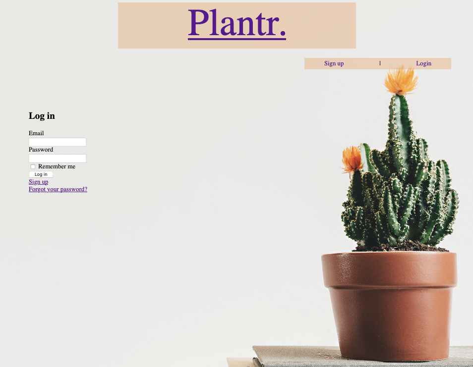

# README
## Plantr.

### What Problem Will Plantr. solve and Why?
There are many marketplace apps to connect members of the community to sell/exchange objects to each other. Gumtree, for example, has a "Pots and Garden Beds" section however it lacks specificity, only allowing for photos, a title, a description, weather the item is being sold or sought and the price. 

Plantr. will improve user's browsing ability by prompting sellers to list more specific features including; drainage, material, shape and dimensions.

For example, a user views a pot listed by a seller. The photo does not show if there is drainage and is taken on a plain background, so there is nothing to reference size. The user requires a specific size and drainage but likes the style of the seller's listing. The user messages the seller to ask about size and drainage, and the seller could take a day or more to get back to the user, only for the user to find the pot is inappropriate. The seller is disappointed that they have not sold their listing and a day has been wasted for both parties. 

### Deployed app:
<a href="https://plantr-marketplace.herokuapp.com/">https://plantr-marketplace.herokuapp.com/</a>
But it's broken. Very sad. I was trying to fix AWS credentials which could be accessed through the rails console but didn't seem to be accessible by Heroku and the app would crash. Things I tried:
- https://devcenter.heroku.com/articles/getting-started-with-rails5#run-the-rails-console
- https://stackoverflow.com/questions/56527148/on-heroku-with-rails-5-2-cannot-load-rails-config-active-storage-service-aw
- https://stackoverflow.com/questions/50365348/rails-5-2-credentials-yaml-enc-and-master-key-not-working-on-heroku
https://blog.eq8.eu/til/rails-52-credentials-tricks.html
- https://stackoverflow.com/questions/49661757/rails-5-2-with-master-key-heroku-deployment
Then it wouldn't regenerate credentials/master key (NameError) and failed to precompile in Heroku and locally, so I unsucessfully googled that, noted the looming deadline, cried and gave up. Hooray!

### Github repository:
<a href="https://github.com/aes89/Plantr.">https://github.com/aes89/Plantr.</a>

### App Description:
#### Purpose
This app was developed to connect people in the community to buy pots, planters and other containers for growing plants from each other.

#### Functionality/Features

- Users: a user can sign up for an account. This gives them access to the other functions (they can only view the home page without signing in) as well as updating their profile (name, email and password).
- Listings: a user can both make and purchase listings. Once a user has made a listing they can return to it to edit it and delete it. A user can view a list of all of their listings, as well as browse through all available listings (listing summaries are displayed on the "browse" page) and view a listing's specifics on the listing's dedicated page.
- Comments: users can leave comments on a specific listing's page. Only the seller (who created the listing) can remove comments, in case they are inappropriate or irrelevant (e.g. another user may make repeated requests to lower the price).
- Payments: a user can purchase a listing which is supported by Stripe. THey click "buy now" and are redirected to Stripe, who manages the payment. Once complete they are redirected back to the app, the listing is marked as "unavailable" and is no longer shown on the "browse" page.
- Transactions: users can view the listings that they have bought and sold on a "transactions" page.

#### Sitemap
Planned site map:

Final site map:

#### Screenshots

|||||
|---|---|---|---|
|Home Page - Not Authenticated|Log In|Sign Up|Home Page - Authenticated|

#### Target Audience
This app is designed for anyone looking to purchase or sell pots, planters or other containers for growing plants to other people in the community. 

#### Tech Stack
##### Front-end
- HTML
- CSS3
- SCSS
- Embedded Ruby
- ?Bulma
- ?Javascript
- ?jQuery
  
##### Back-end
- Ruby 2.6.3
- Ruby on Rails 6.0.3
  
##### Database
- Postgresql

##### Deployment
- Heroku

##### Utilities
- Stripe
- Devise
- AWS S3

##### DevOps
- Git
- Github
- VS Code
- Bundler
- Figma
- Lucidchart

### User Stories
to edit: add headings for as user/buyer/seller

As a user, from the home page I can register for an account by clicking "sign up". I will be taken to the registration page where I can enter my name, email and password.

As a user I can log out from any page using the navigation bar "sign out" link. I will be redirected to the home page.

As a user looking to buy a planter, I can browse through listings with a photo and summarised information.

As a user looking to buy, I can view an individual listing and see a photo and detailed information of the listing.

As a user looking to buy, I can view and individual listing and comment on it to ask questions.

As a user looking to buy, I can purchase a listing by clicking "buy now" on a listing's individual page.

As a user, I can log on from the home page and be directed to/navigate to my profile. 

As a user or a user looking to sell, from my profile page I can update my profile details, delete my profile, and view my personal listings. 

As a user, from my profile, I can delete my listing, or navigate to a listing to edit it.

As a user looking to sell, from my listing's edit page, I can update the specifications of my listing.

As a user looking to sell, I can comment on my own listing's page and delete other user's comments.

### Wire Frames
| | Mobile | Web/Tablet |
|:---:|:---:|:---:|
|Home Page| ||
|Home Page - Logged In| ||
|Sign Up Page|||
|Login Page|||
|User Profile Page - add edit listing button|||
|New Listing|||
|Update Listing|||
|Browse Listings|||
|Comment on Own Listing|||
|Comment on Someone Else's Listing|||

### ERD
Planned ERD:

### High-Level Components

### Third Party Services

### Description of Models

### Description of Database Relations

### Database Schema Design

### Tasks Allocated and Tracked
Tasks were tracked through <a href="https://trello.com">Trello</a> using colour coding and check lists. Tasks were assigned to cards, most with checklists on the cards to break down the task. The cards were also colour coded to:
- differentiate between code based (blue) and documentation based (purple) tasks.
- indicate required tasks (red) and optional/"nice to have" elements (orange).
- show what tasks relate to features of the app (pink).
- show what tasks need to be repeated daily (yellow).
- show what tasks were completed (green).
- show what tasks I am stuck on (teal).
- show what tasks needed to be reviewed before submitting (black).

Cards could also be organised into different columns/lists:
- To Do.
- In Progress.
- To Test.
- Complete.

Trello also allows for cards to be assigned to specific team members, however this project was developed by one person so this feature was not utilised.

|Early Trello Board|  | |
|---|:---:|:---:|
||||
|Part 1|Part 2|Part 3|
|Checklist| | |
|| | |

Click on the screen shots to view them full size.